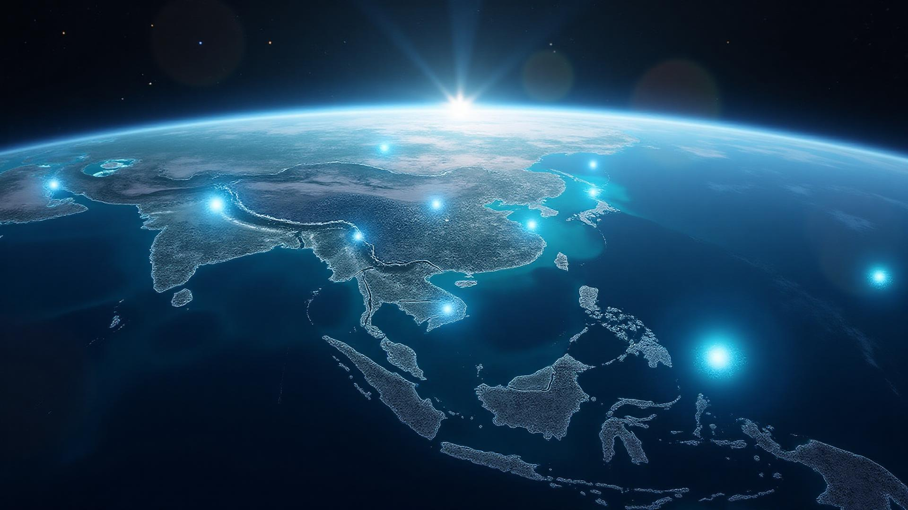

# 🌊 OceanGPT - AI-Powered Ocean Data Explorer

A cutting-edge web application that enables natural language exploration of ocean data from ARGO floats worldwide. Built with React, TypeScript, and Tailwind CSS, featuring an interactive 3D globe visualization and AI-powered chat interface.



## 🚀 Features

- **🤖 Natural Language Queries**: Ask questions about ocean data in plain English
- **🌍 Interactive 3D Globe**: Visualize ARGO float positions with animated markers
- **📊 Profile Analysis**: Deep dive into temperature, salinity, and oxygen profiles
- **🔬 AI-Powered Insights**: ML-driven pattern analysis and oceanographic insights
- **📱 Responsive Design**: Beautiful interface on desktop and mobile
- **🎮 Demo Mode**: Automated scenarios showcasing platform capabilities
- **🎙️ Voice Input**: Mock voice query functionality (Web Speech API)
- **📈 Data Visualization**: Interactive charts for profile comparisons

## 🛠️ Technology Stack

- **Frontend**: React 18 + TypeScript
- **Styling**: Tailwind CSS + Custom Design System
- **UI Components**: Shadcn/ui
- **State Management**: React Hooks
- **Routing**: React Router
- **Charts**: Recharts (ready for Plotly.js integration)
- **Icons**: Lucide React
- **Animations**: Custom CSS animations with ocean theme

## 📊 Mock Data & APIs

The application includes comprehensive mock APIs that simulate real ocean data:

### Available Endpoints (Mock)
- `GET /api/floats` - Retrieve ARGO float data with location and parameters
- `GET /api/floats/{id}/profile` - Get detailed depth profiles for specific floats
- `POST /api/query` - Natural language query processing with AI responses
- `GET /api/nearest` - Find nearest floats to a given location

### Sample Data Structure
```typescript
// Float Data
{
  id: "R12345",
  lat: 0.3245,
  lon: 34.2351,
  alt: -2.0,
  last_seen: "2023-03-12T05:23:00Z",
  profile_count: 58,
  params: ["temperature", "salinity", "oxygen"]
}

// Profile Data  
{
  depth: 0,
  temperature: 29.2,
  salinity: 35.0
}
```

## 🎨 Design System

OceanGPT features a comprehensive ocean-themed design system:

### Color Palette
- **Primary**: Deep Ocean Blue (#0B3D91)
- **Secondary**: Ocean Teal (#00B7C2) 
- **Accent**: Cyan Waves (#37D0D0)
- **Highlight**: Warm Orange (#FFB86B)

### Animations
- Pulse effects for active data points
- Floating animations for interactive elements
- Smooth wave-like transitions
- Hover scale effects with depth shadows

### Typography
- **Primary Font**: Inter (Google Fonts)
- Semantic text sizing and spacing
- High contrast ratios for accessibility

## 🚀 Getting Started

### Prerequisites
- Node.js 16+ 
- npm or yarn

### Installation

1. **Clone the repository**
   ```bash
   git clone <your-repo-url>
   cd oceangpt
   ```

2. **Install dependencies**
   ```bash
   npm install
   # or
   yarn install
   ```

3. **Start development server**
   ```bash
   npm run dev
   # or  
   yarn dev
   ```

4. **Open in browser**
   ```
   http://localhost:8080
   ```

## 🎮 Demo Mode Usage

### Automated Scenarios
The app includes 3 pre-built demo scenarios:

1. **Equatorial Salinity Analysis** (15s)
   - Natural language processing
   - Globe animation to equatorial region
   - Float highlighting and profile display

2. **Atlantic Temperature Trends** (18s) 
   - Voice query simulation
   - Comparative analysis between regions
   - ML-driven insights generation

3. **Pacific Deep Water Analysis** (20s)
   - Multi-parameter queries
   - 3D depth visualization
   - Temporal analysis over seasons

### How to Run Demos
1. Click the **"Demo Mode"** button (bottom right)
2. Select a scenario from the dialog
3. Click **"Start"** to begin automated playthrough
4. Watch as the app demonstrates AI-powered ocean data exploration

## 📁 Project Structure

```
src/
├── components/           # Reusable UI components
│   ├── ui/              # Shadcn/ui base components  
│   ├── ChatPanel.tsx    # AI chat interface
│   ├── GlobeViewer.tsx  # 3D globe visualization
│   ├── FloatInspector.tsx # Detailed float data panel
│   ├── Header.tsx       # Application header
│   └── DemoMode.tsx     # Automated demo scenarios
├── pages/               # Application pages
│   ├── Index.tsx        # Landing page
│   ├── App.tsx          # Main application
│   └── NotFound.tsx     # 404 page  
├── api/                 # Mock API utilities
│   └── floats.ts        # Ocean data mock APIs
├── assets/              # Images and static files
└── hooks/               # Custom React hooks
```

## 🔧 Customization

### Adding New Mock Data
Edit `src/api/floats.ts` to add more float data:

```typescript
const newFloat = {
  id: "R99999",
  lat: 10.0,
  lon: 50.0,
  // ... other properties
};

mockFloats.push(newFloat);
```

### Creating New Demo Scenarios
Add to `src/components/DemoMode.tsx`:

```typescript
const newScenario = {
  id: "custom-demo",
  title: "Your Custom Demo",
  description: "Description of your scenario",
  query: "Your example query",
  duration: 12,
  steps: [
    { action: "chat", description: "Step 1", duration: 3 },
    // ... more steps
  ]
};
```

### Customizing Design System
Modify `src/index.css` for colors and animations:

```css
:root {
  --primary: 215 76% 32%;  /* Your custom primary color */
  --gradient-ocean: linear-gradient(135deg, hsl(var(--primary)), hsl(var(--secondary)));
}
```

## 🌐 Real Integration Notes

To connect with real ocean data APIs:

1. **Replace Mock APIs**: Update `src/api/floats.ts` with real API calls
2. **Add CesiumJS**: Install cesium for true 3D globe (`npm install cesium`)
3. **Implement Auth**: Add NextAuth for user authentication
4. **Add Plotly**: Install plotly.js for advanced charting (`npm install plotly.js`)
5. **Voice Integration**: Implement Web Speech API for real voice input

## 🎯 Performance Features

- **Lazy Loading**: Components load on demand
- **Responsive Images**: Optimized hero images 
- **CSS Animations**: Hardware-accelerated transitions
- **Tree Shaking**: Only used components included in bundle
- **Code Splitting**: Automatic route-based code splitting

## 🧪 Testing

The app is designed for demo purposes with comprehensive mock data. For production:

1. Add unit tests with Jest/React Testing Library
2. Add E2E tests with Cypress or Playwright  
3. Add API integration tests
4. Add accessibility testing with axe-core

## 📝 License

This project is open source and available under the MIT License.

## 🤝 Contributing

Contributions are welcome! Please read our contributing guidelines and submit pull requests for any improvements.

## 📞 Support

For questions or support:
- Open an issue on GitHub
- Check the documentation
- Join our community discussions

---

**Built with ❤️ for ocean data exploration and AI-powered scientific discovery.**
# oceangpt

